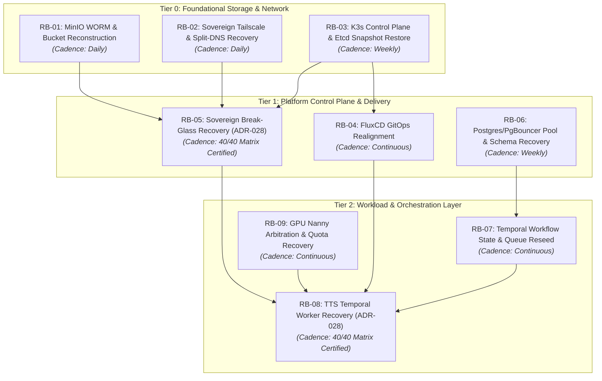

# ADR-029: Continuous DR Runbook Graph and Automated Recertification Architecture

## Status
Accepted

## Context
Sovereign multi-repository platforms (comprising `application`, `infrastructure`, and platform operators) face two fundamental vulnerabilities during disaster recovery (DR):

1. **Runbook Rot (Drift Vulnerability):** Traditional DR runbooks are static markdown documents created during incident postmortems or compliance audits. Over time, cluster API versions, base images, CLI flags (`kubectl`, `kustomize`, `flux`), network topologies, and dependency schemas drift silently. When a real disaster occurs, static runbooks fail at execution time.
2. **Scenario Isolation & Blast Radius Ambiguity:** Disasters are rarely isolated events. An infrastructure incident (e.g. an S3 Object Lock configuration failure or network partition) ripples upward into message queues, database connection pools, and application workers. Without an explicit capability graph, operators struggle to identify recovery prerequisites, leading to cascading failures or improper execution ordering during high-stress incidents.

## Decision

We adopt the **Continuous DR Runbook Graph and Automated Recertification Architecture** across all sovereign infrastructure and application components.

### 1. The Executable Runbook Package Standard
Every DR runbook must be implemented not as passive documentation, but as an **executable, self-verifying control package** residing in `infrastructure/runbooks/` (or `infrastructure/tools/`):

```
infrastructure/runbooks/
└── <RUNBOOK_ID>-<descriptive-name>/
    ├── RUNBOOK.md                # Human-readable procedure, trigger criteria, and operator guide
    ├── manifest.yaml             # Runbook metadata, dependencies, tier, and TTL
    ├── schema.json               # Strict Draft 2020-12 input/envelope schema
    ├── schema.sha256             # Pinned schema integrity checksum
    ├── Dockerfile.runner         # Pinned, rootless container execution environment
    ├── scripts/
    │   ├── prepare.sh            # Pre-flight candidate/input generation
    │   ├── execute.sh            # Idempotent execution engine
    │   └── verify.sh             # Runtime verification gates
    ├── tests/
    │   └── run_certification.sh  # Automated scenario test matrix (TC-01 to TC-N)
    └── receipts/
        └── latest-cert.json      # Cryptographic proof of last successful recertification
```

### 2. Continuous Automated Recertification Lifecycle (Runbook CI)
1. **Automated Test Matrix:** Every runbook package must include an automated test harness covering failure modes (tampered payloads, unpinned keys, schema violations, network partition simulation, and idempotency).
2. **Scheduled Recertification Cadence:** Runbook certification suites execute continuously in CI:
   - **Tier 0/1 Runbooks:** Recertified on every pull request affecting shared tools/manifests, and at least weekly.
   - **Tier 2/3 Runbooks:** Recertified on scheduled platform game-days and prior to minor platform upgrades.
3. **Recertification Freshness & Expiration (TTL):** Every runbook maintains a signed recertification receipt (`latest-cert.json`). If a runbook's certification age exceeds its configured TTL (e.g. 14 days), its status automatically drops from `CERTIFIED` to `STALE_AUDIT_REQUIRED`, raising a platform compliance alert.

### 3. DR Capability Graph (Topological Dependency Model)
Runbooks are structured as nodes in a **Directed Acyclic Graph (DAG)**. Each runbook declares its upstream dependencies and downstream blast radius in `manifest.yaml`:



### 4. DR Scenario Blast-Radius Taxonomy

Disaster recovery scenarios are classified into four distinct tiers based on graph depth:

| Scenario Tier | Failure Class | Graph Traversal Path | Execution Strategy |
|---|---|---|---|
| **Tier 0: Micro / Hotfix** | Single workload regression, runtime crash, blocked egress. | `[RB-05] -> [Target Workload (e.g. RB-08)]` | Isolated break-glass hotfix, JIT locking, 4 runtime verification gates. |
| **Tier 1: Data / Ingestion** | S3 bucket permission/lock loss, PostgreSQL connection starvation, queue backlog. | `[RB-01] -> [RB-06] -> [RB-07]` | Storage policy restore $\rightarrow$ pool drain/reset $\rightarrow$ worker unpause. |
| **Tier 2: Control Plane / GitOps** | Registry bridge disconnect, Flux reconciliation stall, cluster auth rotation. | `[RB-02] -> [RB-04] -> [RB-05]` | Offline runner execution $\rightarrow$ manual commit fast-forward $\rightarrow$ single sync. |
| **Tier 3: Catastrophic Cold-Start** | Total hardware loss, bare-metal node rebuild, cluster re-bootstrap. | **Topological Graph Sort:** `Tier 0 -> Tier 1 -> Tier 2` | Automated multi-runbook orchestration executed in strict topological order. |

### 5. Standard Runbook Manifest Schema (`manifest.yaml`)

Each runbook package declares its contract via a structured manifest:

```yaml
schema_version: "1.0.0"
runbook_id: "RB-05"
title: "Sovereign Break-Glass Delivery and Emergency Recovery"
tier: 1
target_domain: "infrastructure/delivery"
adr_reference: "ADR-028"

dependencies:
  - runbook_id: "RB-01"
    relationship: "required"
    description: "MinIO WORM evidence bucket must be available"
  - runbook_id: "RB-02"
    relationship: "required"
    description: "Registry bridge routing must be resolvable"

recertification:
  cadence: "weekly"
  ttl_days: 14
  test_harness_path: "tools/breakglass/run_certification_suite.sh"
  required_pass_rate: 1.00
  minimum_test_cases: 40

gates:
  - "GATE_0_REGISTRY_PROVENANCE"
  - "GATE_1_LIVE_DIGEST_MATCH"
  - "GATE_2_ROLLOUT_READINESS"
  - "GATE_3_IN_POD_EGRESS"
  - "GATE_4_STARTUP_TELEMETRY"

audit:
  sink: "minio-s3"
  bucket: "infra-data-audit"
  retention_mode: "COMPLIANCE"
  retention_days: 90
```

### 6. Verification and Evidence Archival
* Every runbook execution (drill, automated recertification, or live break-glass incident) MUST emit a signed JSON evidence payload.
* Evidence is stored in the immutable WORM audit bucket (`infra-data-audit`) under `COMPLIANCE` retention mode and verified via `aws s3api get-object-retention`.
* Evidence receipts link the `runbook_id`, `approval_id`, execution SHA, runtime gate results, and upstream dependency statuses.

## Consequences

* **Positive (Zero Runbook Rot):** Runbooks cannot silently decay; drift is detected immediately by scheduled recertification in CI.
* **Positive (Deterministic Cold-Start Recovery):** Catastrophic recovery is executed as a mathematically sorted topological graph traversal rather than human guesswork.
* **Positive (Automated Compliance & Game Days):** Live drills and game days execute certified test harnesses with durable cryptographic proof.
* **Operational Discipline:** Every new infrastructure component or platform service must provide an executable runbook package and test suite as part of production onboarding.
